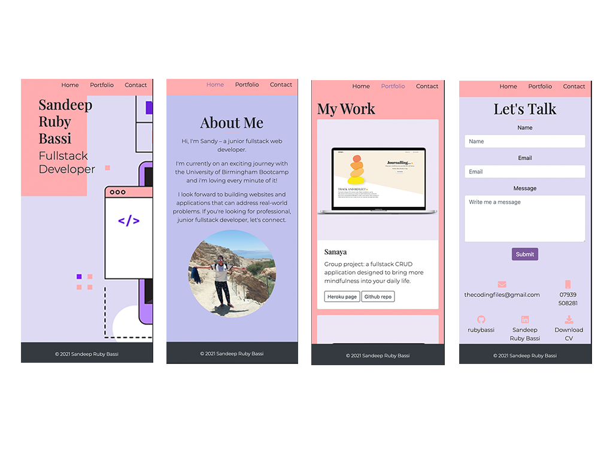
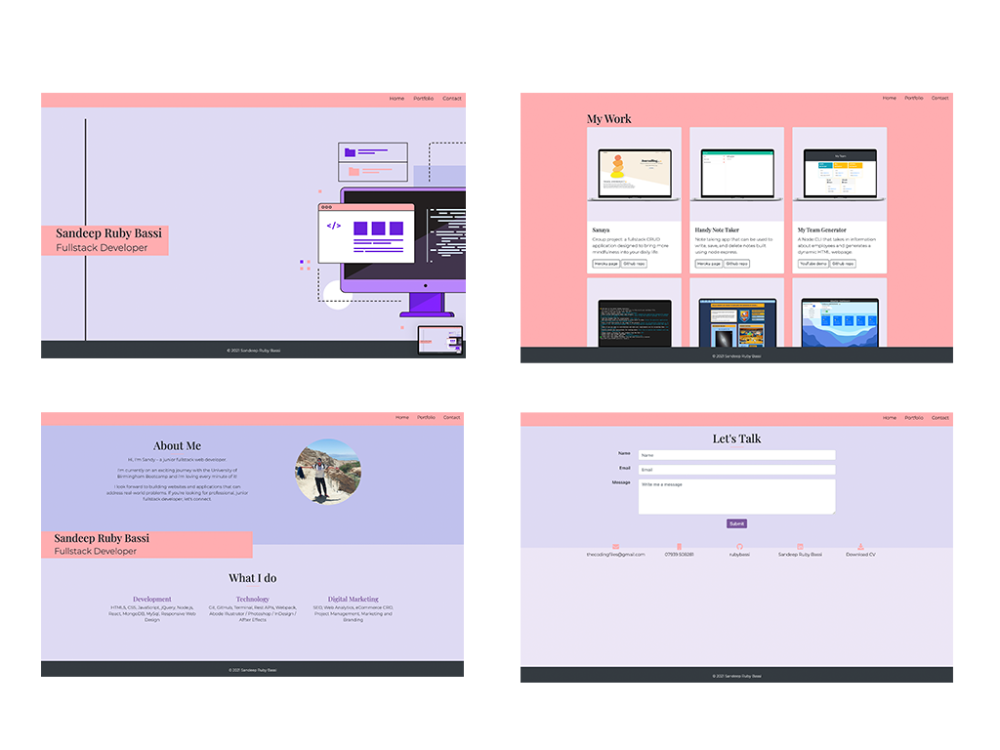

 

# Simple React Portfolio

## Description
For this project I was tasked with creating a simple react portfolio using standard components across multiple pages.

The application features:
  * Homepage with parallex scrolling
  * Portfolio page with links to my deployed applications
  * Contact page with social media links and embedded form. This is pending server-side integration.

## Table of Contents
- [Preview](#Preview)
- [Contributing](#Contributing)
- [License](#License)
- [Environment](#Environment)
- [Questions](#Questions)

## Preview

> Visit the deployed Portfolio on [Github Pages](https://rubybassi.github.io/sandy-react-portfolio/#/).

#### Mobile Responsive

#### Desktop

## Contributing
Contributions are welcomed.

## License
MIT

## Environment
* [Visual Studio Code](https://code.visualstudio.com/)
* [Git](https://git-scm.com/book/en/v2/Getting-Started-Installing-Git)
* [NPM](https://www.npmjs.com/)
* [React](https://reactjs.org/)
* [React Boostrap](https://react-bootstrap.github.io/)
* [React Developer Tools](https://chrome.google.com/webstore/detail/react-developer-tools/fmkadmapgofadopljbjfkapdkoienihi?hl=en)
